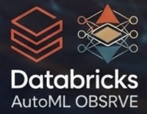

# 📖 Databricks AutoML OBSRVE 🍳

- **Objects**
- **Building**
- **Stacking**
- **Routing**
- **Voting**
- **Ensembles**

Ready-to-use code snippets for building data and AI applications using [Databricks Apps](https://docs.databricks.com/en/dev-tools/databricks-apps/index.html).

## License

&copy; 2026 Databricks, Inc. All rights reserved. The source in this notebook is provided subject to the [Databricks License](https://databricks.com/db-license-source). All included or referenced third party libraries are subject to the licenses set forth below.

Special thanks to **Der große Professor [Christophe Chieu](christophe.chieu@databricks.com)** for samples of Databricks Assistants